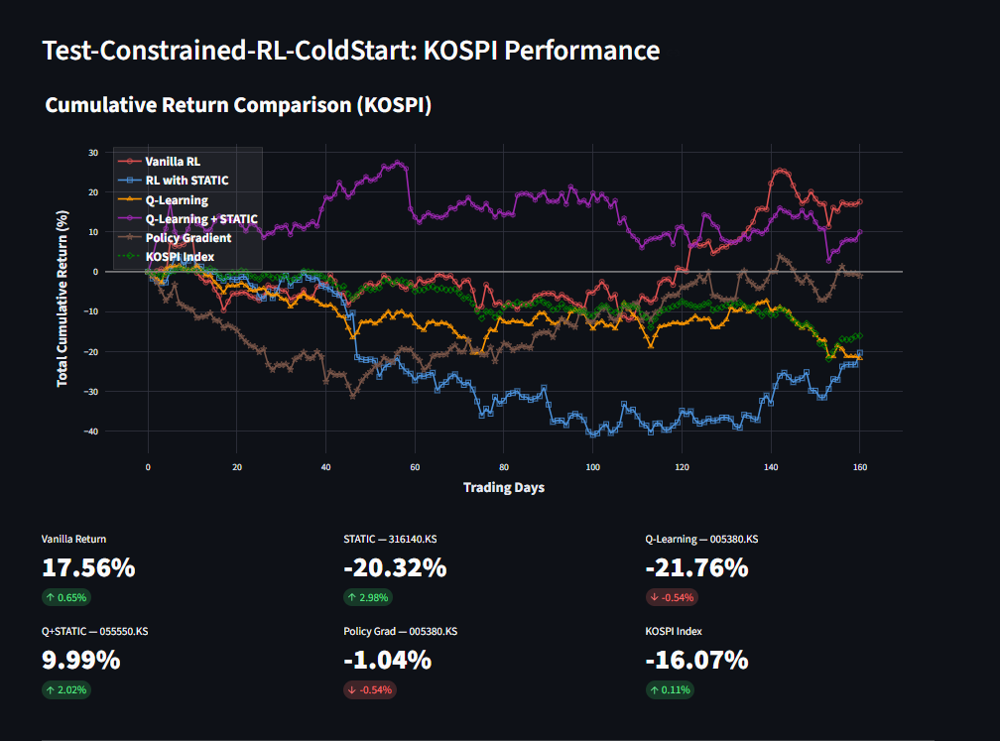
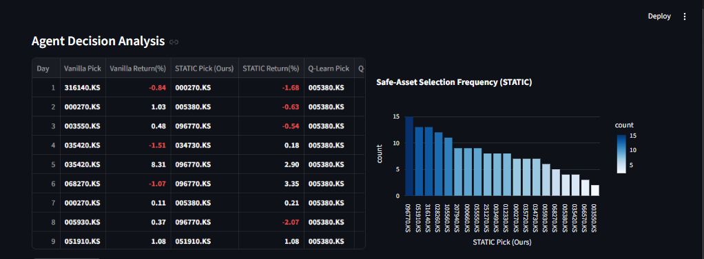
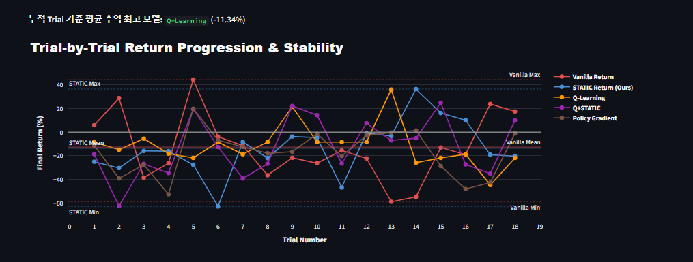
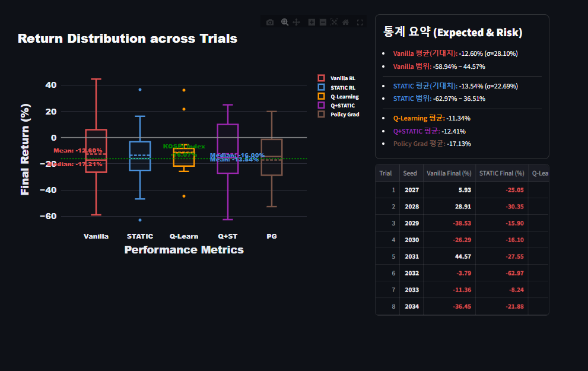

# Test-Constrained-RL-ColdStart 이미지 분석 노트

## 1) 프로젝트 소개

본 프로젝트는 KOSPI 종목군을 대상으로 강화학습 기반 종목 선택 성과를 살펴보는 대시보드입니다.  
비교 대상은 `Vanilla RL`, `STATIC RL`, `Q-Learning`, `Q-Learning+STATIC`, `Policy Gradient`이며, 벤치마크는 `KOSPI Index`입니다.

---

## 2) 데이터 분석 대상 파일

- 메인 대시보드(누적 수익률 비교)
- 에이전트 의사결정 로그 + STATIC 선택 빈도
- Trial별 수익 추이 및 안정성
- Trial 분포(Box Plot) + 통계 요약

---

## 3) 데이터 분석 내용

### 누적 수익률 비교 화면



#### 관찰 내용

- 6개 곡선(5개 에이전트 + KOSPI 지수)의 누적 수익이 동시에 표시됩니다.
- 시점별 성과 우위가 자주 교체되며, 특정 모델의 절대 우위가 고정되지 않습니다.
- 화면 하단 최종 수익 카드 기준으로, 해당 캡처 시점의 상위 성과는 `Vanilla Return 17.56%`, `Q+STATIC 9.99%`로 확인됩니다.
- 동일 시점에서 `STATIC -20.32%`, `Q-Learning -21.76%`, `Policy Grad -1.04%`, `KOSPI -16.07%`를 기록했습니다.

#### 코멘트

- 제약(마스킹) 적용 여부만으로 성과를 단정하기보다, 시장 국면/탐험률/학습 구간 길이에 따라 성능이 크게 달라질 수 있음을 보여줍니다.
- 따라서 단일 실행 결과보다 다회 실행 기반 통계(그림 3, 4)를 함께 해석해야 합니다.

---

### 에이전트 의사결정 로그 화면



#### 관찰 내용

- 좌측 표는 일자별로 각 에이전트가 어떤 종목을 선택했고 얼마의 수익률을 얻었는지 기록합니다.
- 우측 막대그래프는 `STATIC Pick`의 선택 빈도를 집계해, 제약 적용 후 실제로 자주 선택되는 종목을 확인할 수 있습니다.
- 캡처 시점에서는 일부 종목(예: `067...`, `031...`, `316...` 계열)이 상대적으로 높은 빈도로 선택됩니다.

#### 코멘트

- STATIC은 “허용 가능한 종목 집합” 내에서 선택이 이뤄지므로, 선택 분포가 특정 구간에 모이는 경향이 보입니다.
- 이 분포는 리스크 통제 측면에서 장점이 있지만, 탐색 다양성이 줄어들 수 있어 `epsilon`과 학습 구간 튜닝이 중요합니다.

---

### Trial별 수익 추이 화면



#### 관찰 내용

- 각 Trial의 최종 수익을 모델별 라인으로 비교하며, 평균/최대/최소 기준선이 함께 표시됩니다.
- 캡처 상단 문구 기준 `누적 Trial 평균 수익 최고 모델: Q-Learning (-11.34%)`로 표시됩니다.
- 즉 “상대적 최고”가 존재하더라도 전체 평균은 음수일 수 있습니다.

#### 코멘트

- 모델 비교에서 중요한 포인트는 “최대 수익 1회”보다 “반복 실행에서의 일관성”입니다.
- 평균이 음수인 구간에서는 파라미터(`lr`, `gamma`, `epsilon_s`, `epsilon_v`) 재탐색과 학습/평가 구간 재설계가 필요합니다.

---

### 분포 및 통계 요약 화면



#### 관찰 내용

- 박스플롯으로 모델별 분포(중앙값, 사분위, 극단값)를 한 화면에서 비교할 수 있습니다.
- 우측 통계 요약 예시:
  - Vanilla 평균: `-12.60%`, 표준편차 `28.10%`
  - STATIC 평균: `-13.54%`, 표준편차 `22.69%`
  - Q-Learning 평균: `-11.34%`
  - Q+STATIC 평균: `-12.41%`
  - Policy Grad 평균: `-17.13%`
- 캡처 기준으로는 모든 모델 평균이 음수이며, 변동성은 모델별로 차이가 큽니다.

#### 코멘트

- 평균 수익만 보면 Q-Learning이 상대적으로 우위지만, 분산/꼬리위험까지 함께 보면 안정성 우위 모델은 달라질 수 있습니다.
- 현재 설정에서는 하락 국면 방어가 충분하지 않을 수 있어, 추가 튜닝 여지가 분명해 보입니다.

---

## 4) 종합 정리

1. 현재 실험 환경은 여러 RL 에이전트를 같은 시장 구간에서 비교할 수 있도록 잘 구성되어 있습니다.
2. 캡처 기준으로 평균 수익이 전반적으로 음수이기 때문에, 모델 구조 자체의 우열보다 파라미터/학습 설계의 영향이 크게 나타납니다.
3. 그래서 현 단계에서는 **특정 모델의 절대 우위 결론**보다, **튜닝 가능한 실험 프레임워크와 비교 지표를 확보했다는 점**에 의미가 있습니다.

---

## 5) 다음 실험 아이디어

- `epsilon_s` / `epsilon_v` 분리 스윕(2D grid)으로 탐색-안정성 균형 최적점 탐색
- 학습 구간(`training_days`)과 평가 구간(`episodes`) 비율 최적화
- 종목 유니버스 재구성(섹터 균형, 유동성 기준 적용)
- 손실 페널티/거래비용을 보상함수에 포함해 실제 운용에 가까운 조건 검증
- 요약 지표를 `Mean`뿐 아니라 `Median`, `Std`, `Max Drawdown` 중심으로 확장

---

## 6) 실행 방법

```bash
cd "C:\Users\Administrator\Desktop\Task-Constrained-RL-ColdStart_TY_v1-1"
python -m streamlit run app.py
```

브라우저에서 `http://localhost:8501` 접속 후 `Run Evaluation`을 실행하면 동일한 분석 화면을 재현할 수 있습니다.
